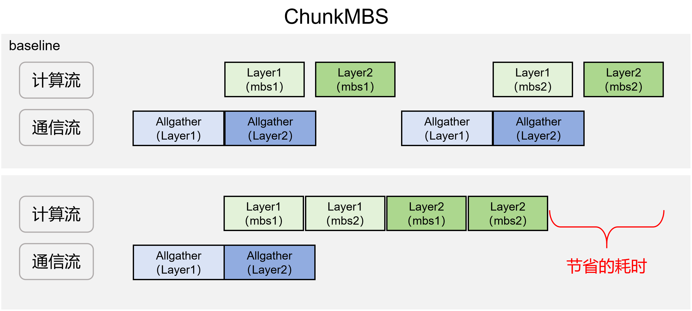

# ChunkMBS

## 背景与挑战

### 当前挑战

在使用 FSDP2 进行大模型训练时，每个 Block 计算前必须完成整块参数的 Unshard 流程（包含异步 Copy-in、异步通信及同步 Copy-out）。在超大参数规模下，通信耗时过长，计算无法完全掩盖通信延迟，且同步 Copy-out 的开销占比过高，直接拖累了训练吞吐。同时，通信与计算对总线带宽的抢占，也导致了并行计算效率的下降。

### 现有方案局限

传统的优化手段主要通过增加序列长度或提高 Micro-Batch Size (MBS) 来增加单次 Unshard 后的计算密度。但这会显著增加显存压力。对于大参数模型而言，静态显存本就占用巨大，导致序列长度和 MBS 的提升空间十分有限，难以通过此路径有效提升整体吞吐。

## 解决方案

### 基础显存优化依赖

本方案建立在重计算（Recomputation）与异步激活卸载（Async Activation Offload）两大基础特性之上。在前向计算阶段，系统仅保留 Layer 入口处的激活值，并通过异步机制将其动态卸载至 Host 侧内存。在此机制下，Device 侧的显存占用主要由两部分构成：

- **静态显存**：模型参数、梯度及优化器经过分片（Sharding）后占用的基础显存。
- **动态显存**：反向重计算阶段，单个 Block 对应单个 Micro-batch 所需的全部激活显存。

### 核心优化方案：细粒度激活切分与异步流水线

为突破显存瓶颈，本方案在单次参数 Unshard 完成后，引入了 Batch 维度的细粒度切分机制，具体实现流程如下：

- **切分与计算**：将当前 Layer 的输入在 Batch 维度上切分为多个微块（Micro-chunks），依次进行前向与反向计算。
- **异步流水线**：在计算间隙，系统异步执行激活值异步offload操作；在反向计算阶段，按需将对应微块的激活值从 Host 迁回（D2H）至 Device，完成该微块的前反向计算后，立即触发下一微块的加载与计算。
- **显存与吞吐收益**：通过该策略，整体激活显存的峰值占用被严格压缩至单个微块的量级。这有效解耦了显存占用与计算规模的强绑定关系，使得在有限的 Device 显存资源下，可以通过灵活增加切块数量来适配更大的计算规模，从而最大化整体训练吞吐。

该方案具体的示意图如下



## 使用方法

注意，该方案需要和[async activation offload](async_activation_offload.md)和重计算特性结合使用，确保开启了chunkmbs特性的modules均已开启activation offload特性和recompute特性，在使用原生FSDP2训练的模型中，开启的方式如下：

```yaml
# 重计算配置
recompute: true
recompute_plan:
    apply_modules:
     - model.visual.blocks.{*}
     - model.language_model.layers.{*}
     
# activation offload 配置
enable_activation_offload: true
activation_offload_plan:
    apply_modules:
     - model.visual.blocks.{*}
     - model.language_model.layers.{*}
     
# chunkmbs配置
enable_chunk_mbs: true
chunkmbs_plan:
    apply_modules:
     - model.language_model.layers.{*}
    chunk_mbs: 2 # 这个表示的是chunk之后的micro batchsize
    batch_dim: 0
    chunk_arg_indexs: [0]
    chunk_kwarg_names: ["position_embeddings", "position_ids", "rope_deltas", "attention_mask"]
```

和chunkmbs配置有关的超参说明如下

- `enable_chunk_mbs`：是否开启chunkmbs特性，`true`表示为开，`False`表示为不开
- `apply_modules`：需要开启该特性的module，使用正则表达式匹配，注意需要被包含在`recompute`特性和`activation_offload`特性的`apply_modules`中
- `chunk_mbs`：chunk之后的mbs，例如原来的`micro_batch_size`为8，切成4份，每份的大小为2，则该字段配置为2
- `batch_dim`：batchsize所在的维度，例如该layer输入的layout是[b, s, h]，则`batch_dim`配置为0，如果该layer输入的layout是[s, b, h]，则`batch_dim`配置为1
- `chunk_arg_indexs`,`chunk_kwarg_names`: 用于表示那些入参需要切分，以下面的输入为例

  ```python
  hidden_states = decoder_layer(
      hidden_states,
      position_embeddings=position_embeddings,
      attention_mask=layer_mask,
      position_ids=text_position_ids,
      past_key_values=past_key_values,
      use_cache=use_cache,
      cache_position=cache_position,
      **kwargs,
  )
  ```

  其中`hidden_states`，`position_embeddings`，`attention_mask`，`position_ids`, `rope_deltas`，需要在`batch_size`维度进行切分，其余入参不需要切分，`hidden_states`是以`args`的形式传入，`position_embeddings`，`attention_mask`，`position_ids`, `rope_deltas`以`kwargs`的形式传入，所以按照上述的配置进行设置。

## 使用效果

在GBS相同的情况下，设置`micro_batch_size`为MBS，设置梯度累积（`GRAD_ACC`）为`GBS/MBS`在每个梯度累积步都要进行每个block参数的unshard，但是开启该特性后，可以设置`micro_batch_size`为GBS，设置梯度累积为1，设置`chunkmbs_plan.chunk_mbs`为`GBS/MBS`，这样每次更新模型参数都只要对每个block进行一次参数unshard，大大节省了通信时间，在Qwen3.5 35B模型上实测整网收益5%左右。
